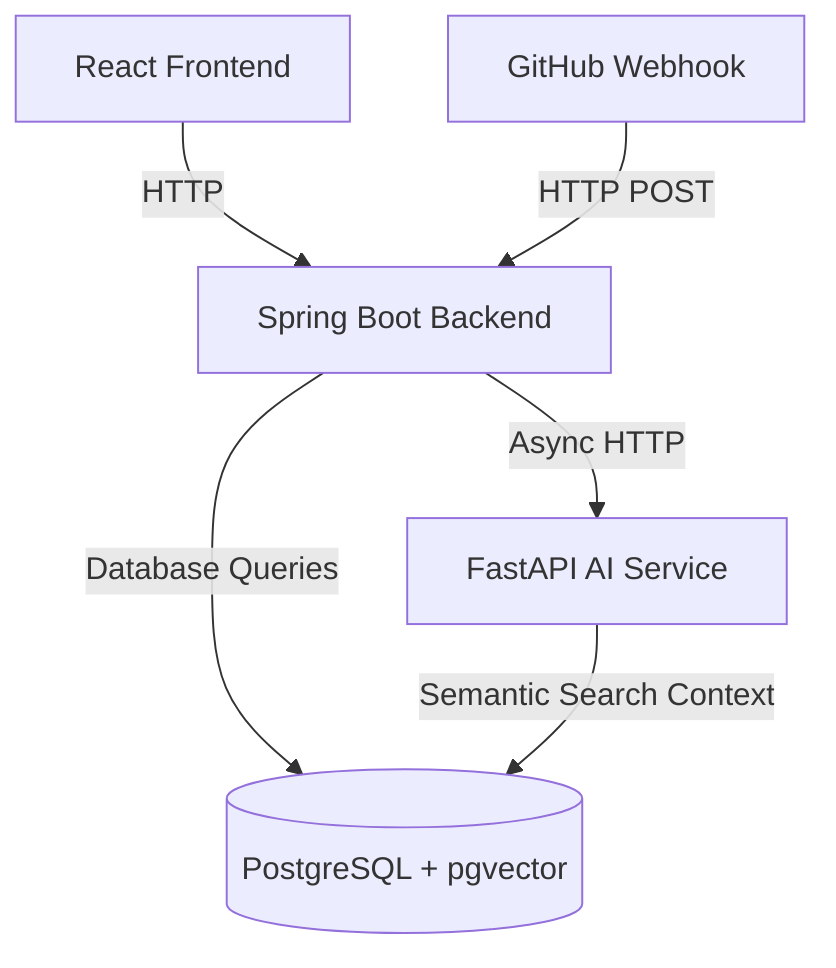

# PRSense - Pull Request Review & Repository Intelligence Platform

PRSense is a platform designed to analyze pull requests, verify code safety, check style rules, and provide repository-wide conversational search. The platform is built as a three-tier architecture:
1. **Frontend**: Vite + React + Framer Motion user interface.
2. **Backend**: Spring Boot Java service for repository management, webhook receiving, and metadata persistence.
3. **AI Service**: FastAPI Python service managing static analysis, security audits, architecture scanning, style checks, and semantic search context retrieval.

---

## 🏛️ Architecture Overview

The system operates in a direct request-response flow:


- **Metadata Database**: PostgreSQL is used to store user accounts, repository definitions, review summaries, and finding listings.
- **Semantic Store**: PostgreSQL with `pgvector` extension stores embedded chunks of repository code to enable context-aware repository conversational chat.
- **Direct Dispatch**: Spring Boot directly invokes the FastAPI AI Service for code indexing and pull request audits.

---

## ✨ Features

- **Multi-Stage Review Pipeline**: Parallel evaluation of code diffs by specialized auditors (Security, Architecture, Style, and Code Quality).
- **Semantic Code Search**: Natural language query interface to fetch codebase citations and context.
- **Repository Indexing**: Processes repository files and generates vector embeddings to form the semantic database context.
- **Interactive Review Workspace**: Graphical UI display of file diffs, finding lists, severity filters, and timeline audit summaries.

---

## 📁 Project Structure

```
prsense/
├── prsense-frontend/          # React + Vite + Tailwind + Framer Motion
│   ├── src/
│   │   ├── pages/              # Views (CommandCenter, PullRequestWorkspace, AskRepository, etc.)
│   │   └── components/         # Layout & Reusable UI elements
│   ├── package.json
│   └── vite.config.js
│
├── prsense-backend/           # Java Spring Boot Backend
│   ├── src/
│   │   ├── main/java/...       # Entities, Repositories, Services, and Controllers
│   │   └── main/resources/     # Application configuration (application.yml)
│   └── pom.xml
│
└── prsense-ai-service/        # Python FastAPI AI Service
    ├── main.py                # API Endpoints
    ├── graph/                 # Workflow Engine Multi-Stage Workflows
    ├── services/              # Analysis Core integration & Semantic Search database utility
    └── requirements.txt       # Python dependencies
```

---

## 🚀 Quick Start

### Prerequisites
- **Docker & Docker Compose** (Installed and running)
- **Java 17+** (Optional, if running backend locally without Docker)
- **Python 3.11+** (Optional, if running AI service locally without Docker)
- **Node.js 18+** (Optional, if running frontend locally without Docker)

### Installation & Deployment

1. **Clone the Repository**
   ```bash
   git clone https://github.com/ansh62949/prsense.git
   cd prsense
   ```

2. **Configure Environment**
   Create a `.env` file at the root:
   ```env
   OPENAI_API_KEY=your-openai-api-key-here
   GEMINI_API_KEY=your-gemini-api-key-here
   ```

3. **Deploy Using Docker Compose**
   ```bash
   docker-compose -f docker-compose.production.yml up --build -d
   ```
   This will spin up:
   - PostgreSQL with pgvector on port `5432`
   - Spring Boot Backend on port `8080`
   - FastAPI AI Service on port `8000`

---

## 🛠️ Service Architecture & Endpoints

| Service | Local Address | Live/Production Address | Description |
|---------|---------------|-------------------------|-------------|
| **Frontend** | `http://localhost:3000` | https://prsense-ai.vercel.app/ | React web application portal |
| **Backend API** | `http://localhost:8080` | https://prsense-ai-1.onrender.com/ | Spring Boot orchestrator and user accounts |
| **Backend Swagger UI** | `http://localhost:8080/swagger-ui.html` | https://prsense-ai-1.onrender.com/swagger-ui/index.html | Spring Boot interactive API testing documentation |
| **Code Analyzer Service** | `http://localhost:8000` | https://prsense-ai.onrender.com/ | FastAPI AI service endpoint |
| **Analyzer Swagger UI** | `http://localhost:8000/docs` | https://prsense-ai.onrender.com/docs | FastAPI interactive API testing documentation |
